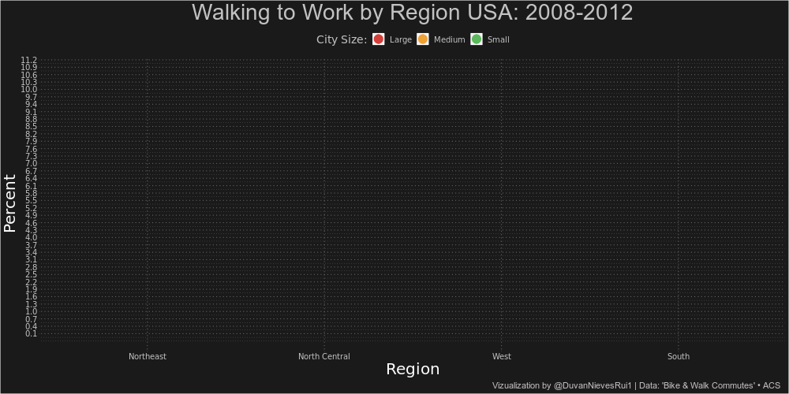

<!-- README.md is generated from README.Rmd. Please edit that file -->

``` r
#Bibliotecas necesarias
library(tidytuesdayR)
library(tidyverse)
library(ggsci)
library(gganimate)
```

``` r
# selecting random week
set.seed(31)
sample(1:45,1)
#> [1] 45
```

``` r
# Data week 45
commute_mode <- readr::read_csv("https://raw.githubusercontent.com/rfordatascience/tidytuesday/master/data/2019/2019-11-05/commute.csv") 
save(commute_mode,file='commute_mode.Rdata')
```

``` r
load('commute_mode.Rdata')
g1 <- commute_mode %>% 
  filter(!is.na(state_region)) %>% 
  filter(mode == "Bike") %>% 
  mutate(frac= n*percent/100) %>% 
  group_by(state_region,city_size) %>% 
  summarise(n=sum(n),frac =sum(frac)) %>% 
  mutate(p = frac/n, moe=1.645*(p*(1-p) %>%
                                  '/'(n) %>% 
                                  sqrt())) %>% 
  mutate(percent=p*100, moe=moe*100) %>% 
  ggplot(., aes(x=reorder(state_region,-percent), 
               y= percent,xend=state_region, 
               ymin=0, ymax=percent, 
               group= reorder(city_size, -percent),
               color=city_size)) +
  geom_linerange(position = position_dodge(.5),
                 linetype='twodash',
                 size=1) +
  geom_point(position = position_dodge(.5),
             size=5) +
  geom_linerange(position = position_dodge(.5),
                 linetype='twodash',
                 size=1) +
  geom_errorbar(aes(ymin= percent-moe, 
                    ymax=percent+moe),
                position = position_dodge(.5),
                width=.3,
                alpha=.5) +
  geom_linerange(position = position_dodge(.5),
                 linetype='twodash',
                 size=1) +
  scale_y_continuous(breaks = seq(.1,5,.2))+
  scale_color_locuszoom()+
  labs(title = "Bicycling to Work by Region USA: 2008:2012",
       x= "Region",
       y= "Percent",
       color="City Size:",
       caption = "Vizualization by @DuvanNievesRui1 | Data: 'Bike & Walk Commutes' • ACS")+
  theme(panel.grid  = element_line(color="grey40"),
        legend.position = "top",
        legend.background = element_rect(fill = "grey10"),
        legend.key.size = unit(.5,"cm"),
        panel.background = element_rect(fill="grey10",color = "grey10"),
        plot.background = element_rect(fill="grey10"),
        plot.title = element_text(size=28, color="grey76",hjust = .5),
        plot.subtitle  = element_text(size=20, color="grey76",hjust = .5),
        plot.caption = element_text(size = 11,color = "grey76", hjust = .99),
        axis.text = element_text(family = "Roboto Mono",
                                 size = 10,
                                 colour = "grey76"),
        axis.title =  element_text(family = "Roboto Mono",
                                   size = 20,
                                   colour = "white"),
        legend.text = element_text(family = "Roboto Mono",
                                   size = 10,
                                   colour = "grey76"),
        legend.title = element_text(family = "Roboto Mono",
                                   size = 14,
                                   colour = "grey76"),
        line = element_line(linetype = "dotted")) +
  transition_layers()+
  shadow_mark()+
  enter_fade() + enter_grow() +
  exit_fade() + exit_shrink()

animate(g1, renderer = gifski_renderer(),height = 500, width =1000,fps = 10)
```

<!-- -->

``` r
g2 <- commute_mode %>% 
  filter(!is.na(state_region)) %>% 
  filter(mode == "Walk") %>% 
  mutate(frac= n*percent/100) %>% 
  group_by(state_region,city_size) %>% 
  summarise(n=sum(n),frac =sum(frac)) %>% 
  mutate(p = frac/n, moe=1.645*(p*(1-p) %>%
                                  '/'(n) %>% 
                                  sqrt())) %>% 
  mutate(percent=p*100, moe=moe*100) %>% 
  ggplot(., aes(x=reorder(state_region,-percent), 
               y= percent,xend=state_region, 
               ymin=0, ymax=percent, 
               group= reorder(city_size, -percent),
               color=city_size)) +
  geom_linerange(position = position_dodge(.5),
                 linetype='twodash',
                 size=1) +
  geom_point(position = position_dodge(.5),
             size=5) +
    geom_linerange(position = position_dodge(.5),
                 linetype='twodash',
                 size=1) +
  geom_errorbar(aes(ymin= percent-moe, 
                    ymax=percent+moe),
                position = position_dodge(.5),
                width=.3,
                alpha=.5) +
  geom_linerange(position = position_dodge(.5),
                 linetype='twodash',
                 size=1) +
  scale_y_continuous(breaks = seq(.1,13,.3))+
  scale_color_locuszoom()+
  labs(title = "Walking to Work by Region USA: 2008-2012",
       x= "Region",
       y= "Percent",
       color="City Size:",
       caption = "Vizualization by @DuvanNievesRui1 | Data: 'Bike & Walk Commutes' • ACS")+
  theme(panel.grid  = element_line(color="grey40"),
        legend.position = "top",
        legend.background = element_rect(fill = "grey10"),
        legend.key.size = unit(.5,"cm"),
        panel.background = element_rect(fill="grey10",color = "grey10"),
        plot.background = element_rect(fill="grey10"),
        plot.title = element_text(size=28, color="grey76",hjust = .5),
        plot.subtitle  = element_text(size=20, color="grey76",hjust = .5),
        plot.caption = element_text(size = 11,color = "grey76", hjust = .99),
        axis.text = element_text(family = "Roboto Mono",
                                 size = 10,
                                 colour = "grey76"),
        axis.title =  element_text(family = "Roboto Mono",
                                   size = 20,
                                   colour = "white"),
        legend.text = element_text(family = "Roboto Mono",
                                   size = 10,
                                   colour = "grey76"),
        legend.title = element_text(family = "Roboto Mono",
                                   size = 14,
                                   colour = "grey76"),
        line = element_line(linetype = "dotted")) +
  transition_layers()+
  shadow_mark()+
  enter_fade() + enter_grow() +
  exit_fade() + exit_shrink()

animate(g2, renderer = gifski_renderer(),height = 500, width =1000,fps = 10)
```

<!-- -->
