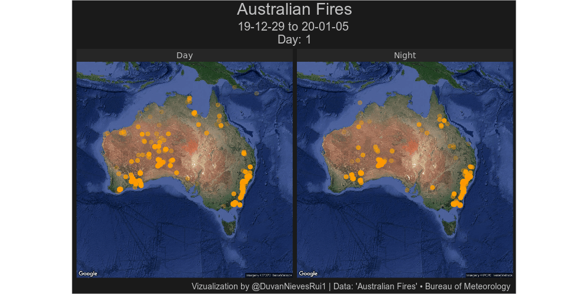
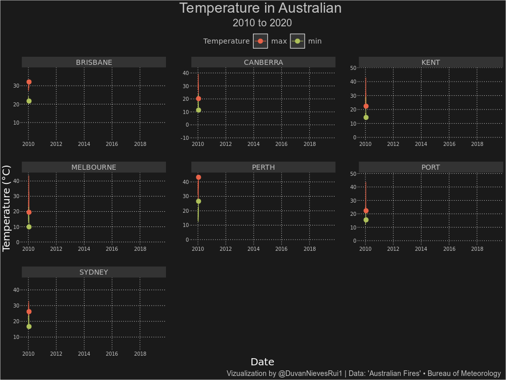

<!-- README.md is generated from README.Rmd. Please edit that file -->

``` r
library(tidytuesdayR)
library(tidyverse)
library(gganimate)
library(ggpointdensity)

library(broom)
library(rnaturalearth)
library(rnaturalearthhires)


library(ggmap)
library(ggthemes)
```

``` r
tt <- tt_load(2020,2) 
save(tt,file="ttload.Rdata")
register_google(key = "your key")
map <- get_map(location=c(135, -30), zoom=4, source = "google", maptype="satellite",crop = T)
save(map,file="map_aus")
#shape_aus<- ne_states("australia") %>% tidy()
```

``` r

load("map_aus")
load("ttload.Rdata")

nasa_fire <- tt$MODIS_C6_Australia_and_New_Zealand_7d %>% 
  arrange(acq_date) %>% 
  mutate(order = row_number())

g <- ggmap(map) +
  geom_pointdensity(data=nasa_fire, aes(x=longitude, y=latitude),size=3, alpha=.2) +
  scale_color_gradient2(low = "yellow",high = "red", mid = "orange")+
  facet_wrap(~daynight, labeller = labeller(daynight= c(D="Day", N="Night"))) +
  transition_manual(acq_date,cumulative = T) +
  labs(title = "Australian Fires",
       caption = "Vizualization by @DuvanNievesRui1 | Data: 'Australian Fires' • Bureau of Meteorology",
       subtitle = paste("19-12-29 to 20-01-05 \n Day: {frame}")) +
  theme(legend.position = "none",
        axis.title =  element_blank(),
        axis.ticks =  element_blank(),
        axis.line = element_blank(),
        axis.text.x = element_blank(),
        axis.text.y = element_blank(),
        panel.background = element_rect(fill="grey10",color = "grey10"),
        plot.background = element_rect(fill="grey10"),
        strip.background = element_rect(fill="grey15"),
        panel.spacing = unit(.5, "lines"),
        plot.title = element_text(size=28, color="grey76",hjust = .5),
        plot.subtitle  = element_text(size=20, color="grey76", hjust = .5),
        plot.caption = element_text(size = 14,color = "grey76", hjust = .98),
        strip.text.x =element_text(family = "Roboto Mono",
                                   size = 14,
                                   colour = "grey76"))

animate(g, renderer = gifski_renderer(),height = 500, width =1000,fps = 10)
```

<!-- -->

``` r
g <- tt$temperature %>% 
  filter(date >= "2010-01-01") %>% 
  ggplot(., aes(x=date, y=temperature, color=temp_type)) +
  facet_wrap(~city_name, scales = "free")+
  geom_line() +
  scale_color_manual(values = c('#EA6349FF','#AFC15BFF'))+
  labs(title = "Temperature in Australian ",
       caption = "Vizualization by @DuvanNievesRui1 | Data: 'Australian Fires' • Bureau of Meteorology",
       color="Temperature",
       subtitle = paste("2010 to 2020"),
       x= "Date",
       y="Temperature (°C)")+
  theme(axis.ticks.y = element_line(color = "grey76"),
        legend.position = "top",
        legend.background = element_rect(fill = "grey10"),
        legend.key.size = unit(1,"cm"),
        legend.key= element_rect(fill="grey20"),
        panel.background = element_rect(fill="grey10",color = "grey10"),
        plot.background = element_rect(fill="grey10"),
        strip.background = element_rect(fil="grey20"),
        panel.spacing = unit(2, "lines"),
        plot.title = element_text(size=28, color="grey76",hjust = .5),
        plot.subtitle  = element_text(size=20, color="grey76", hjust=.5),
        plot.caption = element_text(size = 14,color = "grey76", hjust = .99),
        axis.text = element_text(family = "Roboto Mono",
                                 size = 10,
                                 colour = "grey76"), 
        strip.text.x =element_text(family = "Roboto Mono",
                                   size = 14,
                                   colour = "grey76"), 
        axis.title =  element_text(family = "Roboto Mono",
                                   size = 20,
                                   colour = "white"),
        legend.text = element_text(family = "Roboto Mono",
                                   size = 14,
                                   colour = "grey76"),
        legend.title = element_text(family = "Roboto Mono",
                                   size = 14,
                                   colour = "grey76"),
        panel.grid.minor.x = element_blank(),
        panel.grid.minor.y = element_blank(),
        line = element_line(linetype = "dotted"))+
  geom_point(size=4)+
  transition_reveal(date)
  
animate(g, renderer = gifski_renderer(),height = 750, width =1000,fps = 8)
```

<!-- -->

``` r
library(sf)
library(mapview)
library(tidyverse)

#' Current Incidents Feed (GeoJSON)
#' This feed contains a list of current incidents from the NSW RFS, 
#' and includes location data and Major Fire Update summary information where available. 
#' Click through from the feed to the NSW RFS website for full details of the update. 
#' GeoJSON is a lightweight data standard that has emerged to support the sharing of 
#' information with location or geospatial data. 
#' It is widely supported by modern applications and mobile devices.

url <- "http://www.rfs.nsw.gov.au/feeds/majorIncidents.json"

fires <- st_read(url)

mapview(fires)

#' Hacky way to get rid of points within geometry collections
fire_poly <- fires %>% 
  st_buffer(dist = 0) %>% 
  st_union(by_feature = TRUE)

mapview(fire_poly)
```
