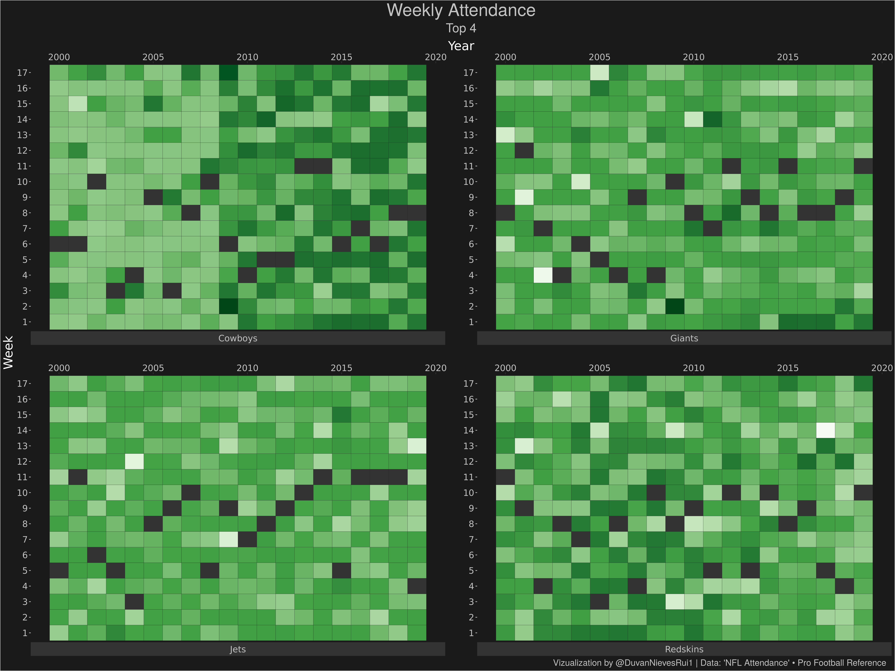
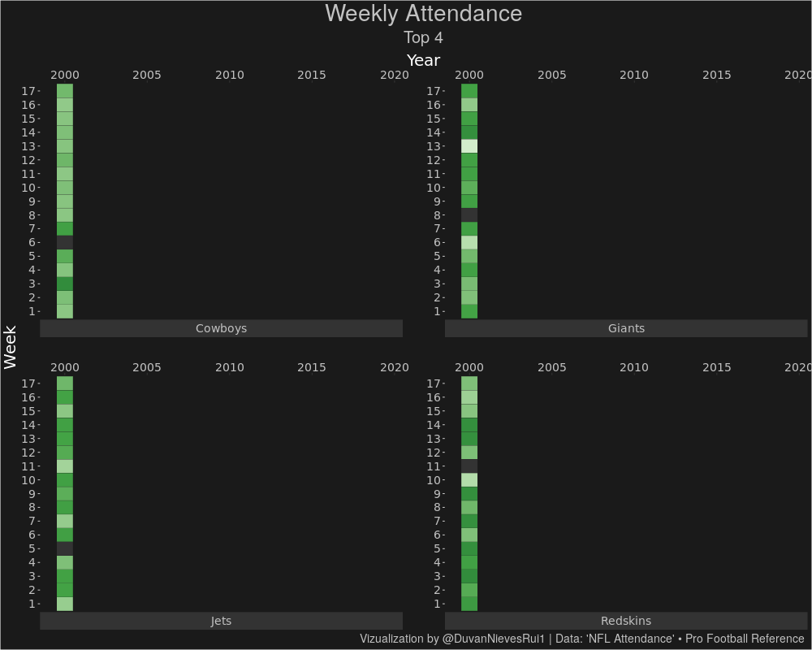

<!-- README.md is generated from README.Rmd. Please edit that file -->

``` r
library(tidytuesdayR)
library(tidyverse)
library(paletteer)
library(grDevices)
library(gganimate)
```

``` r
tt <- tt_load('2020-02-04') 
save(tt,file = "tt.Rdata")
```

``` r
load("tt.Rdata")

top <- tt$attendance %>% 
  filter(!is.na(weekly_attendance)) %>% 
  group_by(team_name) %>% 
  summarise(n = sum(weekly_attendance)) %>% 
  top_n(4)

df <- tt$attendance %>% 
  #filter(!is.na(weekly_attendance)) %>% 
  filter(team_name %in% top$team_name)

g <-   ggplot(df,aes(x=year,y = as.factor(week))) +
  scale_x_continuous(position = "top")+
  scale_fill_paletteer_c("grDevices::Greens",direction = -1)+
  geom_tile(data = subset(df, !is.na(weekly_attendance)), aes(fill = weekly_attendance),  color="grey12")+
  geom_tile(data = subset(df, is.na(weekly_attendance)), fill="grey20", color="grey12")+
  facet_wrap(~team_name,nrow = 2,strip.position = "bottom",scales = "free")+
  labs(title = "Weekly Attendance",
       subtitle = "Top 4",
       x = "Year",
       y = "Week",
       fill = "Rate",
       caption = "Vizualization by @DuvanNievesRui1 | Data: 'NFL Attendance' • Pro Football Reference")+
  theme(panel.grid = element_blank(),
        axis.ticks.y = element_line(color = "grey76"),
        legend.position = "none",
        legend.background = element_rect(fill = "grey10"),
        legend.key.size = unit(1.5,"cm"),
        panel.background = element_rect(fill="grey10",color = "grey10"),
        plot.background = element_rect(fill="grey10"),
        strip.background = element_rect(fil="grey20"),
        panel.spacing = unit(2, "lines"),
        plot.title = element_text(size=28, color="grey76",hjust = .5),
        plot.subtitle  = element_text(size=20, color="grey76", hjust = .5),
        plot.caption = element_text(size = 14,color = "grey76", hjust = .99),
        axis.text = element_text(family = "Roboto Mono",
                                 size = 14,
                                 colour = "grey76"), 
        strip.text.x =element_text(family = "Roboto Mono",
                                   size = 14,
                                   colour = "grey76"), 
        axis.title =  element_text(family = "Roboto Mono",
                                   size = 20,
                                   colour = "white"),
        legend.text = element_text(family = "Roboto Mono",
                                   size = 10,
                                   colour = "grey76"),
        legend.title = element_text(family = "Roboto Mono",
                                   size = 14,
                                   colour = "grey76")) 
g
```

<!-- -->

``` r
g1 <- g + transition_time(year)+
  shadow_mark() + enter_recolor()
animate(g1, renderer = gifski_renderer(),height = 800, width = 1000,fps = 10)
```

<!-- -->
