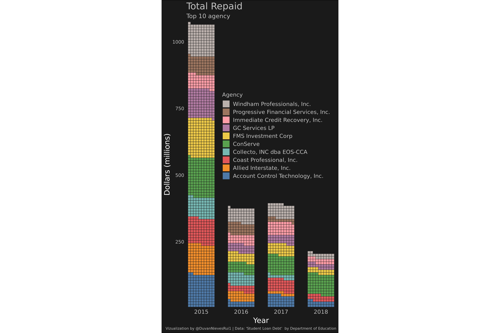

<!-- README.md is generated from README.Rmd. Please edit that file -->

``` r
#Bibliotecas necesarias
library(tidytuesdayR)
library(tidyverse)
library(lubridate)
library(stringr)
library(ggthemes)
library(gganimate)
library(zoo)
library(waffle)
```

``` r
#Lectura de Datos
tt <- tt_load(2019,48) 
tt_dat <- tt$loans 
save(df,file = "loans.Rdata")
```

``` r
as.data.frame(lapply(tt_dat, function(x) sum(is.na(x)))) %>% 
  pivot_longer(
    everything(),
    names_to = "variables",
    values_to = "conteo 'na'"
  ) 
#> # A tibble: 10 x 2
#>    variables          `conteo 'na'`
#>    <chr>                      <int>
#>  1 agency_name                    0
#>  2 year                           0
#>  3 quarter                        0
#>  4 starting                       9
#>  5 added                        160
#>  6 consolidation                  0
#>  7 rehabilitation                 0
#>  8 voluntary_payments            11
#>  9 wage_garnishments              0
#> 10 total                          0

df <- tt_dat %>% 
  mutate(date1 = year+2000) %>% mutate(date2 = paste("Q",tt_dat$quarter,"/",tt_dat$year,sep="")) %>% 
  mutate(date2 = as.Date(as.yearqtr(date2,format="Q%q/%y"))) %>% 
  select(-c(added,year,quarter))
```

``` r
data_top10 <- df %>%
  ungroup() %>%
  group_by(agency_name) %>% 
  summarise(total_y = sum(total)) %>% 
  top_n(10)

top10 <- c(data_top10$agency_name) 

dp <- df %>%
  ungroup() %>%
  group_by(date1,agency_name) %>% 
  summarise(total_y = sum(total)) %>% 
  mutate(total_r = total_y/1000000) %>% 
  filter(agency_name %in% top10 )
```

``` r
  ggplot(dp, aes(fill = agency_name, values = total_r)) +
  geom_waffle(color = "grey10", size = .25, n_rows = 10, flip = T) +
  facet_wrap(~date1, nrow = 1, strip.position = "bottom") +
  scale_x_discrete() + 
  scale_y_continuous(labels = function(x) x *10,
                     expand = c(0,0)) +
  scale_fill_tableau( ) +
  coord_equal() +
  labs(
    title = "Total Repaid",
    subtitle = "Top 10 agency",
    x = "Year",
    y = "Dollars (millions)",
    fill = "Agency",
    caption = "Vizualization by @DuvanNievesRui1 | Data: 'Student Loan Debt'  by Department of Education") +
  theme_minimal(base_family = "Roboto Condensed") +
  theme(panel.grid = element_blank(), 
        axis.ticks.y = element_line(),
        legend.position = c(.6,.6),
        panel.background = element_rect(fill="grey10",color = "grey10"),
        plot.background = element_rect(fill="grey10"),
        panel.spacing = unit(1.5, "lines"),
        plot.title = element_text(size=20, color="grey76"),
        plot.subtitle  = element_text(size=13, color="grey76"),
        plot.caption = element_text(size = 7.8,color = "grey76", hjust = .98),
        axis.text = element_text(family = "Roboto Mono",
                                 size = 10,
                                 colour = "grey76"), 
        strip.text.x =element_text(family = "Roboto Mono",
                                   size = 12,
                                   colour = "grey76"), 
        axis.title =  element_text(family = "Roboto Mono",
                                   size = 16,
                                   colour = "white"),
        legend.text = element_text(family = "Roboto Mono",
                                   size = 12,
                                   colour = "grey76"),
        legend.title = element_text(family = "Roboto Mono",
                                   size = 12,
                                   colour = "grey76")) +
  guides(fill = guide_legend(reverse = T)) 
```


