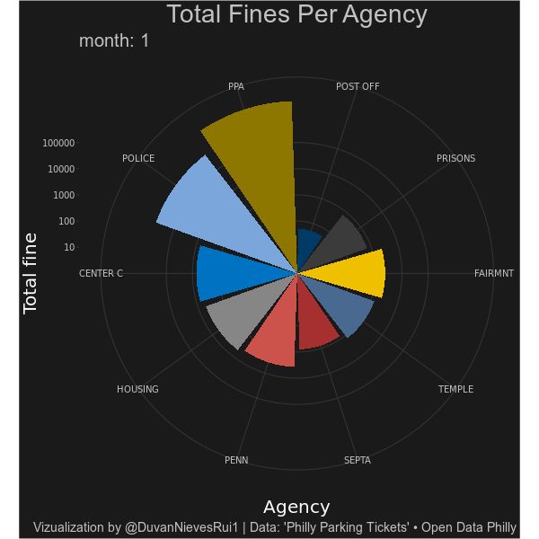
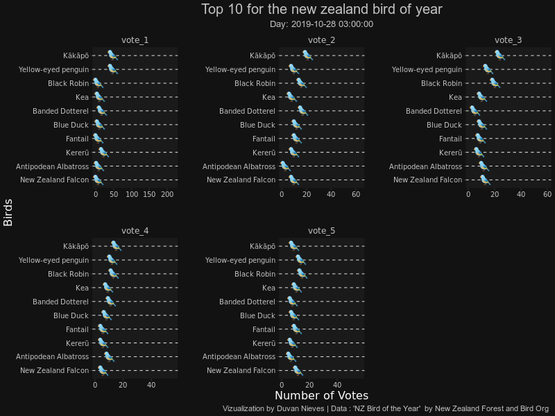
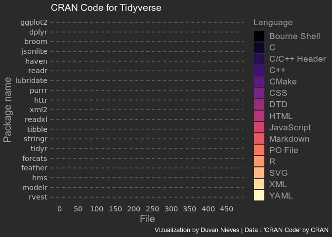

<!-- README.md is generated from README.Rmd. Please edit that file -->

```{r, include = FALSE}
knitr::opts_chunk$set(
  collapse = TRUE,
  comment = "#>"
)
library(knitr)
```

# Tidytuesday

<!-- badges: start -->
<!-- badges: end -->

This repository contains the contributions in #TidyTuesday

<a href="https://github.com/rfordatascience/tidytuesday" target="_blank">TidyTuesday</a>

## Contributions

### `2019`
<!-- <details><summary>2019</summary> -->

+--------------------------------+----------------+---------+---------------+
| Theme                          | Date           |  Week   | Code          |
+================================+:==============:+:=======:+:=============:+
|CRAN Code                       |`2019-11-12`    |   46    |<a href="https://duvancho321.github.io/Tidyuesday/Folder/12-11-19" target="_blank">File</a>    |
+--------------------------------+----------------+---------+---------------+
|NZ Bird of the Year             |`2019-11-19`    |   47    |<a href="https://duvancho321.github.io/Tidyuesday/Folder/19-11-19" target="_blank">File</a>    |
+--------------------------------+----------------+---------+---------------+
|Student Loan Debt               |`2019-11-26`    |   48    |<a href="https://duvancho321.github.io/Tidyuesday/Folder/26-11-19" target="_blank">File</a>    |
+--------------------------------+----------------+---------+---------------+
|Philly Parking Tickets          |`2019-12-03`    |   49    |<a href="https://duvancho321.github.io/Tidyuesday/Folder/01-12-19" target="_blank">File</a>    |
+--------------------------------+----------------+---------+---------------+
|Replicating plots in R          |`2019-12-10`    |   50    |<a href="https://duvancho321.github.io/Tidyuesday/Folder/10-12-19" target="_blank">File</a>    |
+--------------------------------+----------------+---------+---------------+
|                                |                |         |               |
+--------------------------------+----------------+---------+---------------+


```{r, echo=FALSE, out.width= "550", out.height="1300"}
#include_graphics("./Folder/26-11-19/README_files/figure-gfm/unnamed-chunk-4-1.png")
```


#### Week 50


#### Week 49




#### Week 48


#### Week 47



#### Week 46


