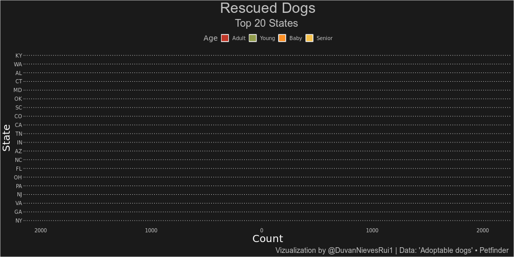
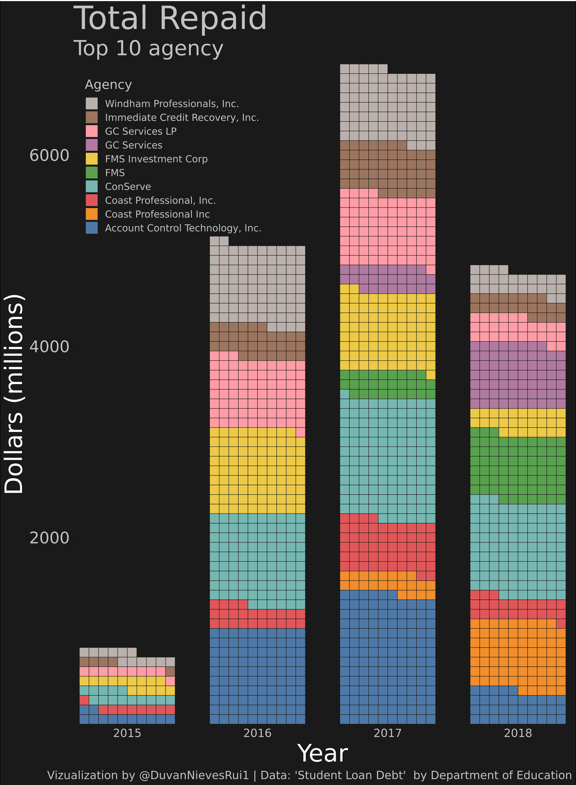
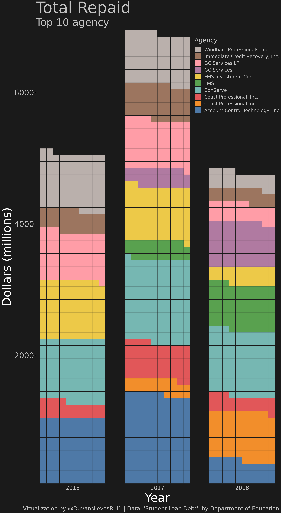
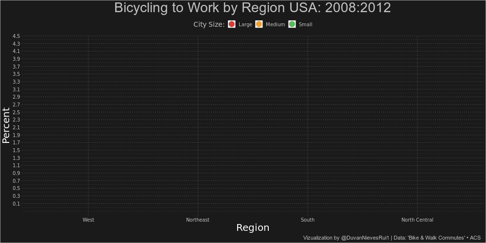

<!-- README.md is generated from README.Rmd. Please edit that file -->

```{r, include = FALSE}
knitr::opts_chunk$set(
  collapse = TRUE,
  comment = "#>"
)
library(knitr)
```

# Tidytuesday

<!-- badges: start -->
<!-- badges: end -->

This repository contains the contributions in #TidyTuesday

<a href="https://github.com/rfordatascience/tidytuesday" target="_blank">#TidyTuesday</a>

## Contributions

<details><summary>2019 </summary> 

### `2019`  

+--------------------------------+----------------+---------+---------------+
| Theme                          | Date           |  Week   | Code          |
+================================+:==============:+:=======:+:=============:+
|CRAN Code                       |`2019-11-12`    |   46    |<a href="https://duvancho321.github.io/Tidyuesday/Folder/2019/12-11-19" target="_blank">File</a> |
+--------------------------------+----------------+---------+---------------+
|NZ Bird of the Year             |`2019-11-19`    |   47    |<a href="https://duvancho321.github.io/Tidyuesday/Folder/2019/19-11-19" target="_blank">File</a> |
+--------------------------------+----------------+---------+---------------+
|Student Loan Debt               |`2019-11-26`    |   48    |<a href="https://duvancho321.github.io/Tidyuesday/Folder/2019/26-11-19" target="_blank">File</a> |
+--------------------------------+----------------+---------+---------------+
|Philly Parking Tickets          |`2019-12-03`    |   49    |<a href="https://duvancho321.github.io/Tidyuesday/Folder/2019/01-12-19" target="_blank">File</a> |
+--------------------------------+----------------+---------+---------------+
|Replicating plots in R          |`2019-12-10`    |   50    |<a href="https://duvancho321.github.io/Tidyuesday/Folder/2019/10-12-19" target="_blank">File</a> |
+--------------------------------+----------------+---------+---------------+
|Adoptable dogs                  |`2019-12-17`    |   51    |<a href="https://duvancho321.github.io/Tidyuesday/Folder/2019/17-12-19" target="_blank">File</a> |
+--------------------------------+----------------+---------+---------------+
|Christmas Songs                 |`2019-12-24`    |   52    |<a href="https://duvancho321.github.io/Tidyuesday/Folder/2019/24-12-19" target="_blank">File</a> |
+--------------------------------+----------------+---------+---------------+

<details><summary>Week 52 📉 </summary> 


</details>
<details><summary>Week 51 📉 </summary> 



</details>
<details><summary>Week 50 📉 </summary>


</details>
<details><summary>Week 49 📉 </summary> 


</details>
<details><summary>Week 48 📉 </summary> 






</details>
<details><summary>Week 47 📉 </summary> 


</details>
<details><summary>Week 46 📉 </summary> 


</details>

</details>


### `2020`

+--------------------------------+----------------+---------+---------------+
| Theme                          | Date           |  Week   | Code          |
+================================+:==============:+:=======:+:=============:+
|Bike & Walk Commutes            |`2019-12-31`    |    1    |<a href="https://duvancho321.github.io/Tidyuesday/Folder/2019/31-12-19" target="_blank">File</a> |
+--------------------------------+----------------+---------+---------------+
|                                |`2020-01-07`    |    2    |<a href="https://duvancho321.github.io/Tidyuesday/Folder/2020/2020-01-07" target="_blank">File</a> |
+--------------------------------+----------------+---------+---------------+
|                                |`2020-01-14`    |    3    |<a href="https://duvancho321.github.io/Tidyuesday/Folder/2020/2020-01-14" target="_blank">File</a> |
+--------------------------------+----------------+---------+---------------+
|                                |`2020-01-21`    |    4    |<a href="https://duvancho321.github.io/Tidyuesday/Folder/2020/2020-01-21" target="_blank">File</a> |
+--------------------------------+----------------+---------+---------------+
|                                |`2020-01-28`    |    5    |<a href="https://duvancho321.github.io/Tidyuesday/Folder/2020/2020-01-28" target="_blank">File</a> |
+--------------------------------+----------------+---------+---------------+
|                                |`2020-02-04`    |    6    |<a href="https://duvancho321.github.io/Tidyuesday/Folder/2020/2020-02-04" target="_blank">File</a> |
+--------------------------------+----------------+---------+---------------+
|                                |`2020-02-11`    |    7    |<a href="https://duvancho321.github.io/Tidyuesday/Folder/2020/2020-02-11" target="_blank">File</a> |
+--------------------------------+----------------+---------+---------------+
|                                |`2020-02-18`    |    8    |<a href="https://duvancho321.github.io/Tidyuesday/Folder/2020/2020-02-18" target="_blank">File</a> |
+--------------------------------+----------------+---------+---------------+
|                                |`2020-02-25`    |    9    |<a href="https://duvancho321.github.io/Tidyuesday/Folder/2020/2020-02-25" target="_blank">File</a> |
+--------------------------------+----------------+---------+---------------+
|                                |`2020-03-03`    |    10   |<a href="https://duvancho321.github.io/Tidyuesday/Folder/2020/2020-03-03" target="_blank">File</a> |
+--------------------------------+----------------+---------+---------------+
|                                |`2020-03-10`    |    11   |<a href="https://duvancho321.github.io/Tidyuesday/Folder/2020/2020-03-10" target="_blank">File</a> |
+--------------------------------+----------------+---------+---------------+
|                                |`2020-03-17`    |    12   |<a href="https://duvancho321.github.io/Tidyuesday/Folder/2020/2020-03-17" target="_blank">File</a> |
+--------------------------------+----------------+---------+---------------+
|                                |`2020-03-24`    |    13   |<a href="https://duvancho321.github.io/Tidyuesday/Folder/2020/2020-03-24" target="_blank">File</a> |
+--------------------------------+----------------+---------+---------------+
|                                |`2020-03-31`    |    14   |<a href="https://duvancho321.github.io/Tidyuesday/Folder/2020/2020-03-31" target="_blank">File</a> |
+--------------------------------+----------------+---------+---------------+
|                                |`2020-04-07`    |    15   |<a href="https://duvancho321.github.io/Tidyuesday/Folder/2020/2020-04-07" target="_blank">File</a> |
+--------------------------------+----------------+---------+---------------+
|                                |`2020-04-14`    |    16   |<a href="https://duvancho321.github.io/Tidyuesday/Folder/2020/2020-04-14" target="_blank">File</a> |
+--------------------------------+----------------+---------+---------------+
|                                |`2020-04-21`    |    17   |<a href="https://duvancho321.github.io/Tidyuesday/Folder/2020/2020-04-21" target="_blank">File</a> |
+--------------------------------+----------------+---------+---------------+
|                                |`2020-04-28`    |    18   |<a href="https://duvancho321.github.io/Tidyuesday/Folder/2020/2020-04-28" target="_blank">File</a> |
+--------------------------------+----------------+---------+---------------+
|                                |`2020-05-05`    |    19   |<a href="https://duvancho321.github.io/Tidyuesday/Folder/2020/2020-05-05" target="_blank">File</a> |
+--------------------------------+----------------+---------+---------------+
|                                |`2020-05-12`    |    20   |<a href="https://duvancho321.github.io/Tidyuesday/Folder/2020/2020-05-12" target="_blank">File</a> |
+--------------------------------+----------------+---------+---------------+
|                                |`2020-05-19`    |    21   |<a href="https://duvancho321.github.io/Tidyuesday/Folder/2020/2020-05-19" target="_blank">File</a> |
+--------------------------------+----------------+---------+---------------+
|                                |`2020-05-26`    |    22   |<a href="https://duvancho321.github.io/Tidyuesday/Folder/2020/2020-05-26" target="_blank">File</a> |
+--------------------------------+----------------+---------+---------------+
|                                |`2020-06-02`    |    23   |<a href="https://duvancho321.github.io/Tidyuesday/Folder/2020/2020-06-02" target="_blank">File</a> |
+--------------------------------+----------------+---------+---------------+
|                                |`2020-06-09`    |    24   |<a href="https://duvancho321.github.io/Tidyuesday/Folder/2020/2020-06-09" target="_blank">File</a> |
+--------------------------------+----------------+---------+---------------+
|                                |`2020-06-16`    |    25   |<a href="https://duvancho321.github.io/Tidyuesday/Folder/2020/2020-06-16" target="_blank">File</a> |
+--------------------------------+----------------+---------+---------------+
|                                |`2020-06-23`    |    26   |<a href="https://duvancho321.github.io/Tidyuesday/Folder/2020/2020-06-23" target="_blank">File</a> |
+--------------------------------+----------------+---------+---------------+
|                                |`2020-06-30`    |    27   |<a href="https://duvancho321.github.io/Tidyuesday/Folder/2020/2020-06-30" target="_blank">File</a> |
+--------------------------------+----------------+---------+---------------+
|                                |`2020-07-07`    |    28   |<a href="https://duvancho321.github.io/Tidyuesday/Folder/2020/2020-07-07" target="_blank">File</a> |
+--------------------------------+----------------+---------+---------------+
|                                |`2020-07-14`    |    29   |<a href="https://duvancho321.github.io/Tidyuesday/Folder/2020/2020-07-14" target="_blank">File</a> |
+--------------------------------+----------------+---------+---------------+
|                                |`2020-07-21`    |    30   |<a href="https://duvancho321.github.io/Tidyuesday/Folder/2020/2020-07-21" target="_blank">File</a> |
+--------------------------------+----------------+---------+---------------+
|                                |`2020-07-28`    |    31   |<a href="https://duvancho321.github.io/Tidyuesday/Folder/2020/2020-07-28" target="_blank">File</a> |
+--------------------------------+----------------+---------+---------------+
|                                |`2020-08-04`    |    32   |<a href="https://duvancho321.github.io/Tidyuesday/Folder/2020/2020-08-04" target="_blank">File</a> |
+--------------------------------+----------------+---------+---------------+
|                                |`2020-08-11`    |    33   |<a href="https://duvancho321.github.io/Tidyuesday/Folder/2020/2020-08-11" target="_blank">File</a> |
+--------------------------------+----------------+---------+---------------+
|                                |`2020-08-18`    |    34   |<a href="https://duvancho321.github.io/Tidyuesday/Folder/2020/2020-08-18" target="_blank">File</a> |
+--------------------------------+----------------+---------+---------------+
|                                |`2020-08-25`    |    35   |<a href="https://duvancho321.github.io/Tidyuesday/Folder/2020/2020-08-25" target="_blank">File</a> |
+--------------------------------+----------------+---------+---------------+
|                                |`2020-09-01`    |    36   |<a href="https://duvancho321.github.io/Tidyuesday/Folder/2020/2020-09-01" target="_blank">File</a> |
+--------------------------------+----------------+---------+---------------+
|                                |`2020-09-08`    |    37   |<a href="https://duvancho321.github.io/Tidyuesday/Folder/2020/2020-09-08" target="_blank">File</a> |
+--------------------------------+----------------+---------+---------------+
|                                |`2020-09-15`    |    38   |<a href="https://duvancho321.github.io/Tidyuesday/Folder/2020/2020-09-15" target="_blank">File</a> |
+--------------------------------+----------------+---------+---------------+
|                                |`2020-09-22`    |    39   |<a href="https://duvancho321.github.io/Tidyuesday/Folder/2020/2020-09-22" target="_blank">File</a> |
+--------------------------------+----------------+---------+---------------+
|                                |`2020-09-29`    |    40   |<a href="https://duvancho321.github.io/Tidyuesday/Folder/2020/2020-09-29" target="_blank">File</a> |
+--------------------------------+----------------+---------+---------------+
|                                |`2020-10-06`    |    41   |<a href="https://duvancho321.github.io/Tidyuesday/Folder/2020/2020-10-06" target="_blank">File</a> |
+--------------------------------+----------------+---------+---------------+
|                                |`2020-10-13`    |    42   |<a href="https://duvancho321.github.io/Tidyuesday/Folder/2020/2020-10-13" target="_blank">File</a> |
+--------------------------------+----------------+---------+---------------+
|                                |`2020-10-20`    |    43   |<a href="https://duvancho321.github.io/Tidyuesday/Folder/2020/2020-10-20" target="_blank">File</a> |
+--------------------------------+----------------+---------+---------------+
|                                |`2020-10-27`    |    44   |<a href="https://duvancho321.github.io/Tidyuesday/Folder/2020/2020-10-27" target="_blank">File</a> |
+--------------------------------+----------------+---------+---------------+
|                                |`2020-11-03`    |    45   |<a href="https://duvancho321.github.io/Tidyuesday/Folder/2020/2020-11-03" target="_blank">File</a> |
+--------------------------------+----------------+---------+---------------+
|                                |`2020-11-10`    |    46   |<a href="https://duvancho321.github.io/Tidyuesday/Folder/2020/2020-11-10" target="_blank">File</a> |
+--------------------------------+----------------+---------+---------------+
|                                |`2020-11-17`    |    47   |<a href="https://duvancho321.github.io/Tidyuesday/Folder/2020/2020-11-17" target="_blank">File</a> |
+--------------------------------+----------------+---------+---------------+
|                                |`2020-11-24`    |    48   |<a href="https://duvancho321.github.io/Tidyuesday/Folder/2020/2020-11-24" target="_blank">File</a> |
+--------------------------------+----------------+---------+---------------+
|                                |`2020-12-01`    |    49   |<a href="https://duvancho321.github.io/Tidyuesday/Folder/2020/2020-12-01" target="_blank">File</a> |
+--------------------------------+----------------+---------+---------------+
|                                |`2020-12-08`    |    50   |<a href="https://duvancho321.github.io/Tidyuesday/Folder/2020/2020-12-08" target="_blank">File</a> |
+--------------------------------+----------------+---------+---------------+
|                                |`2020-12-15`    |    51   |<a href="https://duvancho321.github.io/Tidyuesday/Folder/2020/2020-12-15" target="_blank">File</a> |
+--------------------------------+----------------+---------+---------------+
|                                |`2020-12-22`    |    52   |<a href="https://duvancho321.github.io/Tidyuesday/Folder/2020/2020-12-22" target="_blank">File</a> |
+--------------------------------+----------------+---------+---------------+

<details><summary>Week 1 📉 </summary> 




</details>