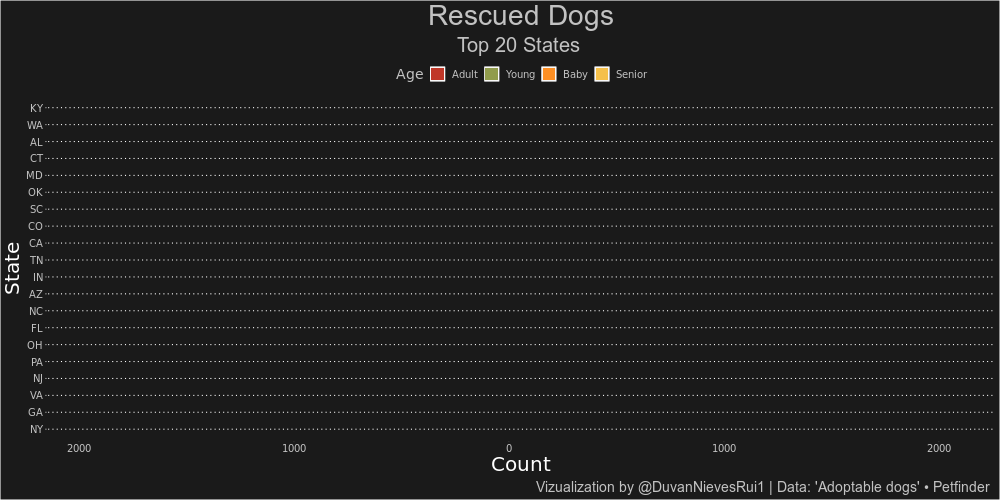
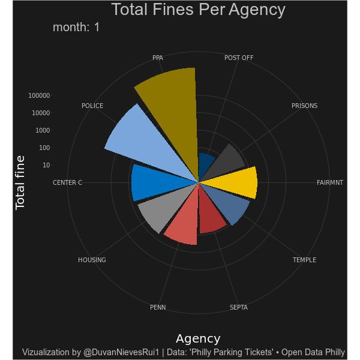
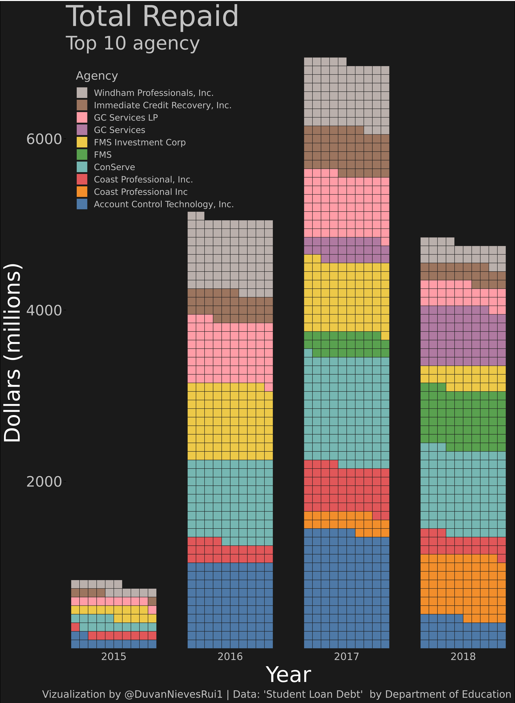
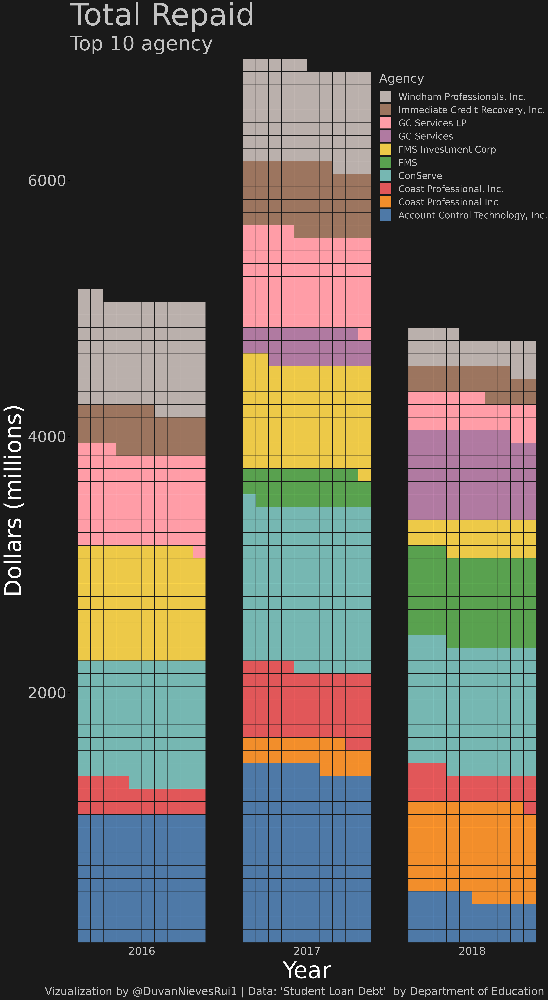
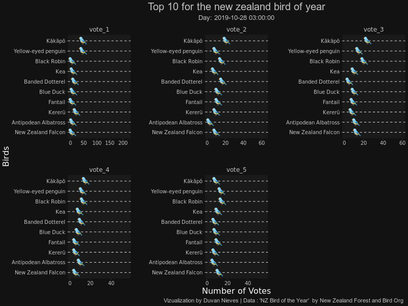
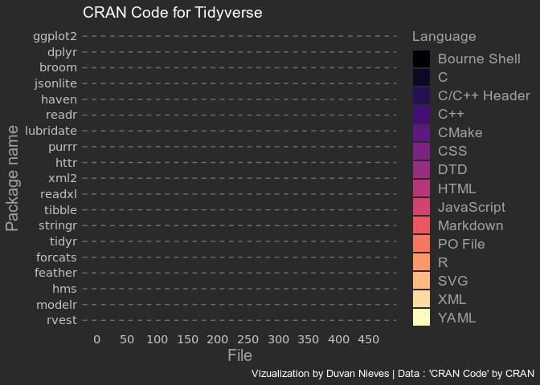

<!-- README.md is generated from README.Rmd. Please edit that file -->

# Tidytuesday

<!-- badges: start -->

<!-- badges: end -->

This repository contains the contributions in
\#TidyTuesday

<a href="https://github.com/rfordatascience/tidytuesday" target="_blank">\#TidyTuesday</a>

## Contributions

### `2019`

| Theme                  |     Date     | Week |                                               Code                                                |
| ---------------------- | :----------: | :--: | :-----------------------------------------------------------------------------------------------: |
| CRAN Code              | `2019-11-12` |  46  | <a href="https://duvancho321.github.io/Tidyuesday/Folder/2019/12-11-19/" target="_blank">File</a> |
| NZ Bird of the Year    | `2019-11-19` |  47  | <a href="https://duvancho321.github.io/Tidyuesday/Folder/2019/19-11-19/" target="_blank">File</a> |
| Student Loan Debt      | `2019-11-26` |  48  | <a href="https://duvancho321.github.io/Tidyuesday/Folder/2019/26-11-19/" target="_blank">File</a> |
| Philly Parking Tickets | `2019-12-03` |  49  | <a href="https://duvancho321.github.io/Tidyuesday/Folder/2019/01-12-19/" target="_blank">File</a> |
| Replicating plots in R | `2019-12-10` |  50  | <a href="https://duvancho321.github.io/Tidyuesday/Folder/2019/10-12-19/" target="_blank">File</a> |
| Adoptable dogs         | `2019-12-17` |  51  | <a href="https://duvancho321.github.io/Tidyuesday/Folder/2019/17-12-19/" target="_blank">File</a> |
|                        |              |      |                                                                                                   |
|                        |              |      |                                                                                                   |

Week 51 📉

Week 50 📉

Week 49 📉

Week 48 📉

Week 47 📉

Week 46 📉

